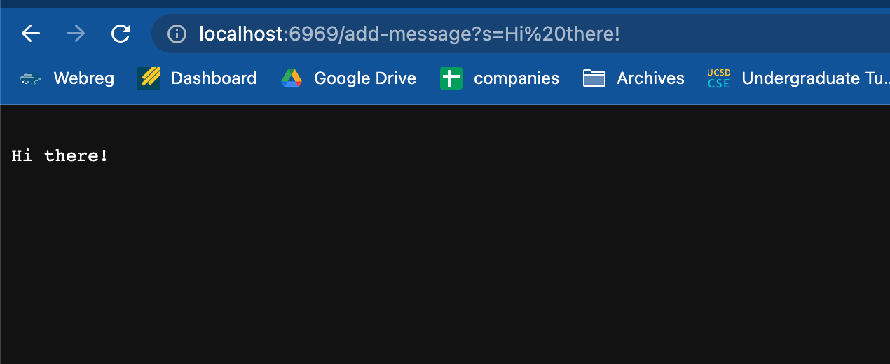
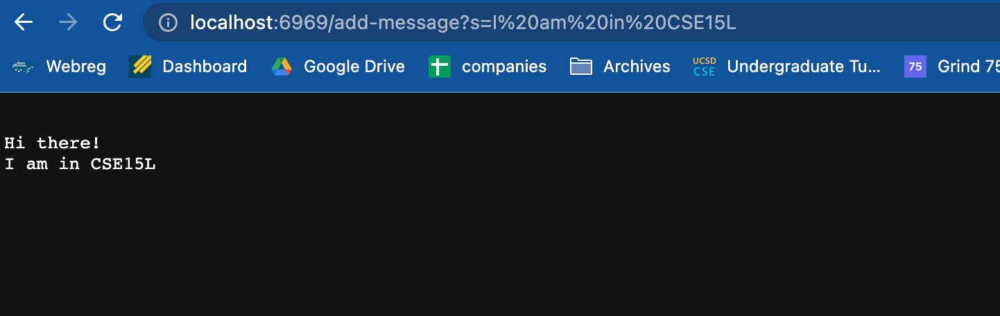

# Lab Report 2 - Servers and Bugs
## String Server
To make a web server that can display and take in input strings via query in the URL, the code will look something like this:
```
import java.io.IOException;
import java.net.URI;
import java.util.*;

class Handler implements URLHandler {
    // The one bit of state on the server: a number that will be manipulated by
    // various requests.
    List<String> list = new ArrayList<>();

    public String handleRequest(URI url) {  
        if (url.getPath().equals("/")) {
            return String.format("Current String list: %s", list.toString());
        } else if (url.getPath().contains("/add")) {
            System.out.println("Path: " + url.getPath());
            String[] parameters = url.getQuery().split("=");
            if(parameters[0].equals("s")){
                list.add(parameters[1]);
                return String.format("String added!");
            }
            return "404 Not Found!";
        } else {
            if(url.getPath().contains("/search")){
                System.out.println("Path: " + url.getPath());
                String[] parameters = url.getQuery().split("=");
                if (parameters[0].equals("s")) {
                    List<String> newList = new ArrayList<>();
                    for(String str : list){
                        if(str.contains(parameters[1])){
                            newList.add(str);
                        }
                    }
                    return String.format("Words that contain " + parameters[1] + ": %s", newList.toString());
                }
                
            }
            return "404 Not Found!";
        }
    }
}
class SearchEngine {
    public static void main(String[] args) throws IOException {
        if(args.length == 0){
            System.out.println("Missing port number! Try any number between 1024 to 49151");
            return;
        }

        int port = Integer.parseInt(args[0]);

        Server.start(port, new Handler());
    }
}
```
# How the website works

The main method sets up the web server on the desired port, in this case 6969. In the `Handler` class, `HandleRequest` is run which tests the validity of the URL that is passed in. Therefore, the URL in String form is a necessary parameter, and our String `list` is relevant because the value of it will be displayed on the server. If a valid add-message URL is passed in, `list` will be updated by having the query message added on to its current value. In this case, `list` was an empty string and `"Hi there!"` was added onto it. 
&nbsp;  
&nbsp;  

Like the previous image, the main method sets up the web server on the desired port, in this case 6969. In the `Handler` class, `HandleRequest` is run which tests the validity of the URL that is passed in. Therefore, the URL in String form is a necessary parameter, and our String `list` is relevant because the value of it will be displayed on the server. If a valid add-message URL is passed in, `list` will be updated by having the query message added on to its current value. In this case, `list` had the value `"Hi there!"` and `"I am in CSE15L"` was added onto it. 
&nbsp;  
&nbsp;  
## Lab 3 Bug
Here is an example of a faulty reverse array method: 
```
// Changes the input array to be in reversed order
  static void reverseInPlace(int[] arr) {
    for(int i = 0; i < arr.length; i += 1) {
      arr[i] = arr[arr.length - i - 1];
    }
  }
```
&nbsp;  
&nbsp;  
