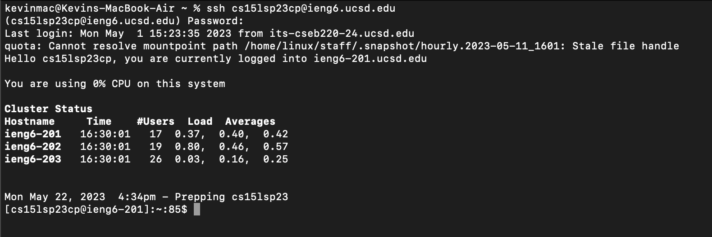

# Lab Report 4 - Vim

*Steps 1-3 have already been completed.*

## 4. Log into ieng6

Keystrokes:
- `ssh cs15lsp23cp@ieng6.ucsd.edu <enter>` Remotely connect to your course specific CSE15L account.

## 5. Clone your fork of the repository from your Github account

Keystrokes:
- `git clone git@github.com:kevinlu021/lab7.git <enter>` After authenticating a SSH key for GitHub, we clone a forked repository of lab 7 to our ieng6 account.

## 6. Run the tests, demonstrating that they fail

Keystrokes:
- `ls` Check to make sure the `lab 7` repository was successfully cloned
- `javac -cp ".:lib/hamcrest-core-1.3.jar:lib/junit-4.13.2.jar" *.java` This command compiles all the Java files in the current directory while including the Hamcrest and JUnit libraries in the classpath
- `java -cp ".:lib/junit-4.13.2.jar:lib/hamcrest-core-1.3.jar" org.junit.runner.JUnitCore ListExamplesTests` Run the tester file ListExamplesTests.java
- One test does indeed fail.

## 7. Edit the code file to fix the failing test

Keystrokes:
- `vim ListExamples.java` Open up `ListExamples.java` in the Vim editor
- `Shift + g` Moves cursor to end of the file
- `<k><k><k><k><k><k><e>` Move cursor up six lines to line with the error, then to the end of the next work, which in this case is "index1"
- `i` Enter insert mode.
- `<right><backspace><2>` Move cursor after the "1" in "index1", delete it, and replace with "2"
- `<esc>` Return to normal mode.
- `:wq` Save and quit the editor.

## 8. Run the tests, demonstrating that they now succeed

Keystrokes:
- `ls` Check to make sure the `lab 7` repository was successfully cloned
- `javac -cp ".:lib/hamcrest-core-1.3.jar:lib/junit-4.13.2.jar" *.java` This command compiles all the Java files in the current directory while including the Hamcrest and JUnit libraries in the classpath
- `java -cp ".:lib/junit-4.13.2.jar:lib/hamcrest-core-1.3.jar" org.junit.runner.JUnitCore ListExamplesTests` Run the tester file ListExamplesTests.java
- All tests pass now.

