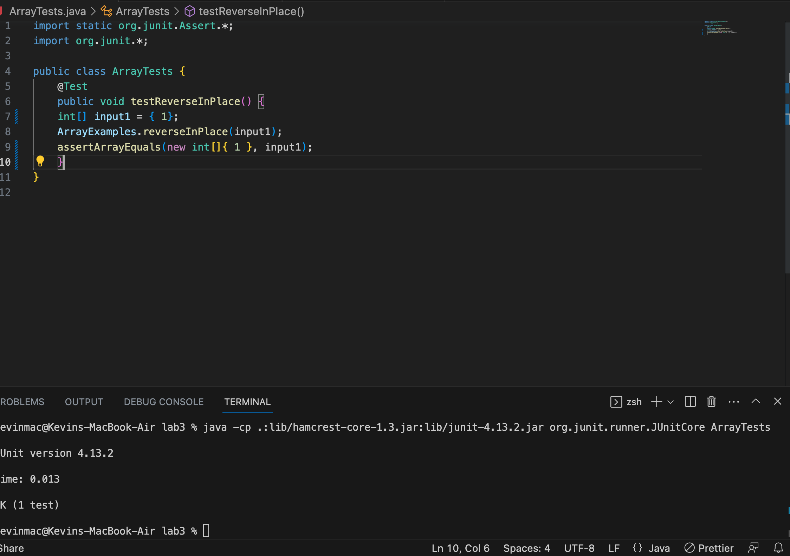
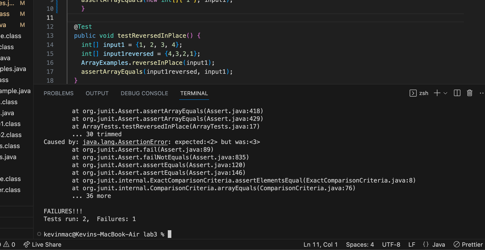

# Lab 5 Report
## Original Post


What environment are you using (computer, operating system, web browser, terminal/editor, and so on)?

> I am on my personal MacBook. I opened and cloned Lab 3 repository via Github Desktop and am editing the code in Visual Studio Code.


Detail the symptom you're seeing. Be specific; include both what you're seeing and what you expected to see instead. Screenshots are great, copy-pasted terminal output is also great. Avoid saying “it doesn't work”.

> Here is what my symptom looks like:


> Because `input1` is an array of size 1, reversing it should effectively do nothing — the output should be the same array. However, not only does my test fail when I use assertArrayEquals, but it seems there is an IllegalArgumentException error.


Detail the failure-inducing input and context. That might mean any or all of the command you're running, a test case, command-line arguments, working directory, even the last few commands you ran. Do your best to provide as much context as you can.

> My code for the JUnit tests is as follows:
```
public class ArrayTests {
	@Test 
	public void testReverseInPlace() {
    int[] input1 = { 3 };
    ArrayExamples.reverseInPlace(input1);
    assertArrayEquals(new int[]{ 3 }, input1);
	}
  ``` 
  > My reverseInPlace code is as follows:
  ```
  static void reverseInPlace(int[] arr) {
    for(int i = 0; i < arr.length; i += 1) {
      arr[i] = arr[arr.length - i - 1];
    }
  }
  ```
  > And, as you can see in my previous screenshot, I ran the two following commands
  > `javac -cp .:lib/hamcrest-core-1.3.jar:lib/junit-4.13.2.jar *.java`<br>
  > `java -cp .:lib/hamcrest-core-1.3.jar:lib/junit-4.13.2.jar org.junit.runner.JUnitCore ArrayTests.java`

## TA Response

> wsg gang, <br>
>   I would recommend double checking your terminal commands. Just a hint, when you run the `java` command and feed in <file name>, the computer will search for the file <file name>.class, so in this case it would search for "ArrayTests.java.class". Notice anything wrong? \*rawr\* <br>

> Additionally, I would recommend running tests on more rigorous examples. If you're reversing an array, it would be a good idea to test a longer array, of length 2 or possibly greater, to see if the behavior still matches what you expect. You currently are only testing edge cases which is good, but not enough! 
> Hope that helps ;)
  
## Student Reponse

> Wow thanks! I realized that there were actually two parts to my symptom! First of all, you were right about the `java` command. My file "ArrayTests.class" was not being searched for by my command, so I simply just removed the ".java" in my second commmand to fix it. Here's a pic:
 <br>
> But then, I added in some more rigorous tests as you suggested, and it turns out they failed! So, that meant something was wrong with my reverseInPlace method. Here's what I mean:
 <br>
> Turns out I had some logic errors in my method. I needed to swap element i from n-1-i, where n is the length of the array. Also, I needed to loop only to the halfway mark in order to not reverse what I swapped originally. Once that was fixed, everything worked, as shown here:
 <br>
	
	
## Recap
	
To sum it all up, to replicate this error, you will need to clone the Lab 3 repository on GitHub and open it on your code editor of choice. I used it on my personal laptop, cloned with Github Desktop, and opened the code in VS Code. Use the javac command to compile everything, and then use the faulty java command to attempt to run the tests. By removing ".java" from the java command, it then works, but we're not finished. We have non-rigorous tests, and by writing a good one we can see our implementation of our method is flawed. By fixing the logic, and re-running the tests, we now have completely fixed the error. 

	
## Reflection
	
I learned many new things during my lab sections, but one of the most interesting to me was the concept of the SSH. I've never really heard of the concept of being able to remotely connect to a shared server that could support the terminal commands I'd been using on my mac, much less make changes to the files and directories in there as well!

